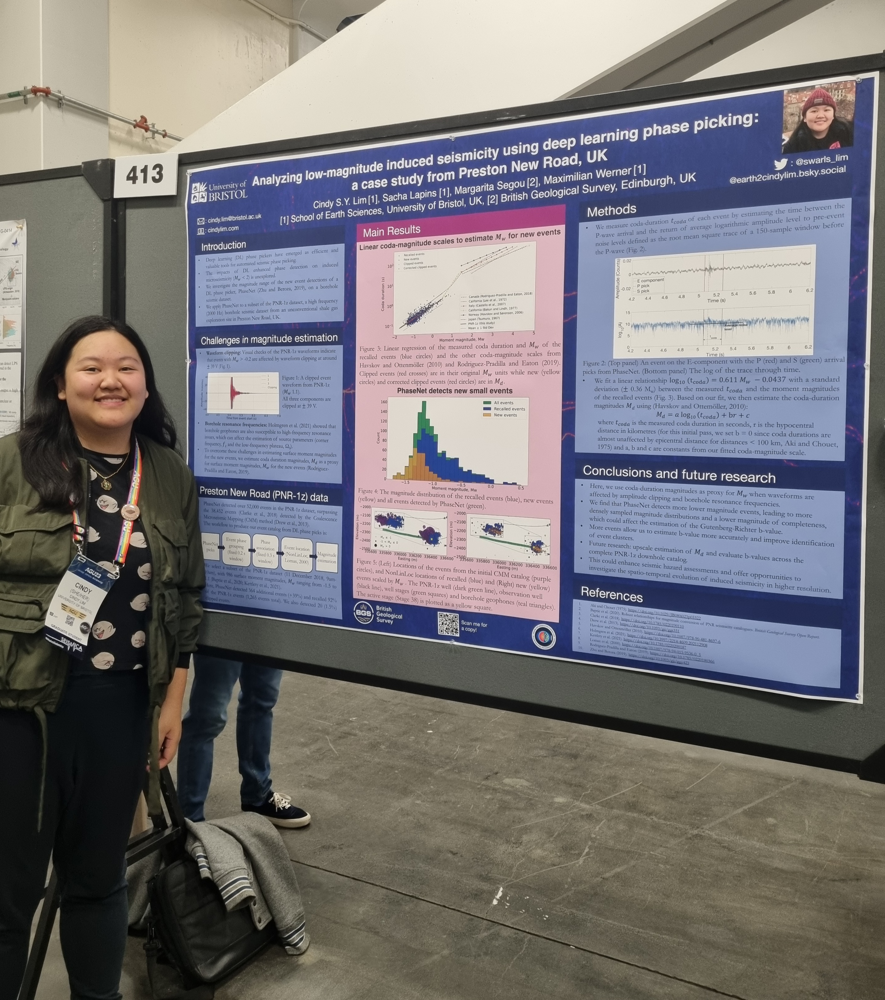
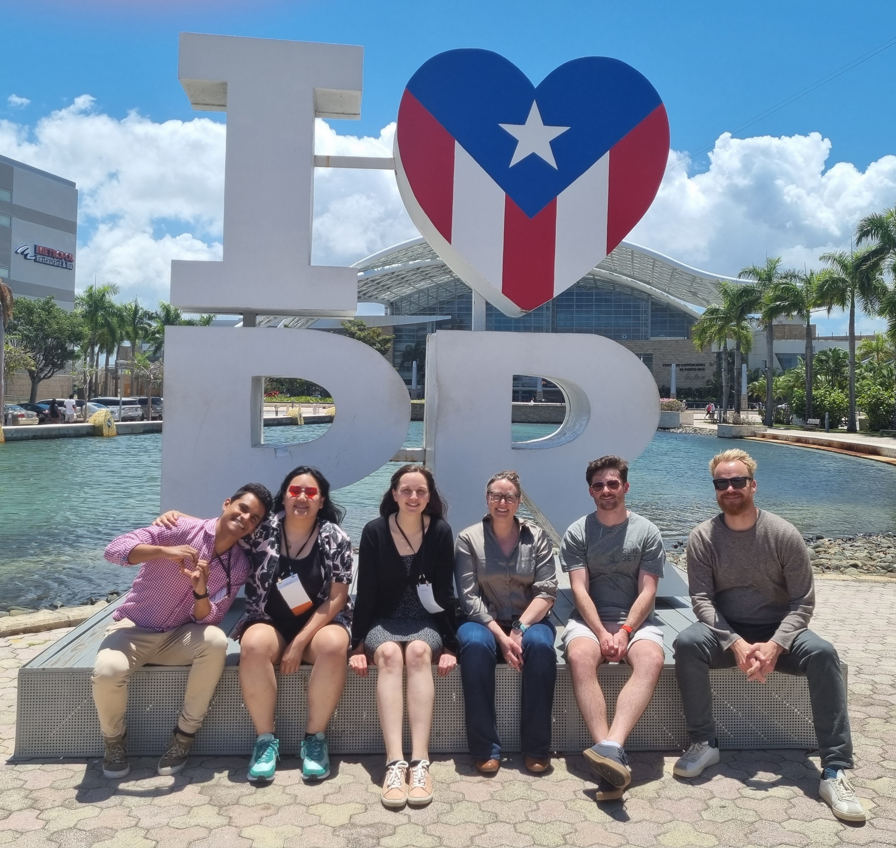
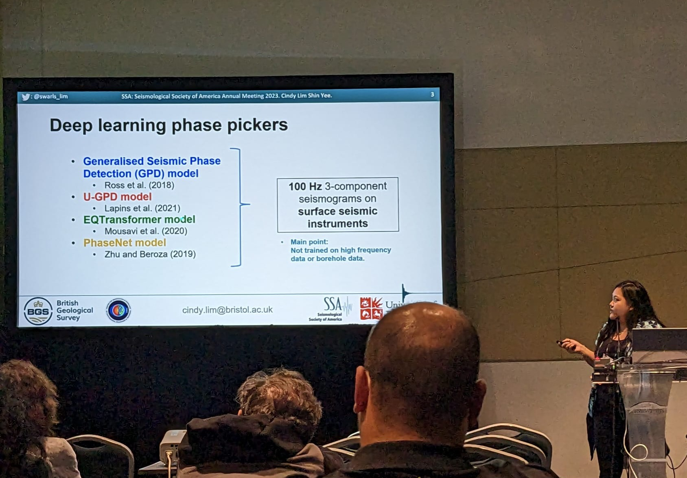
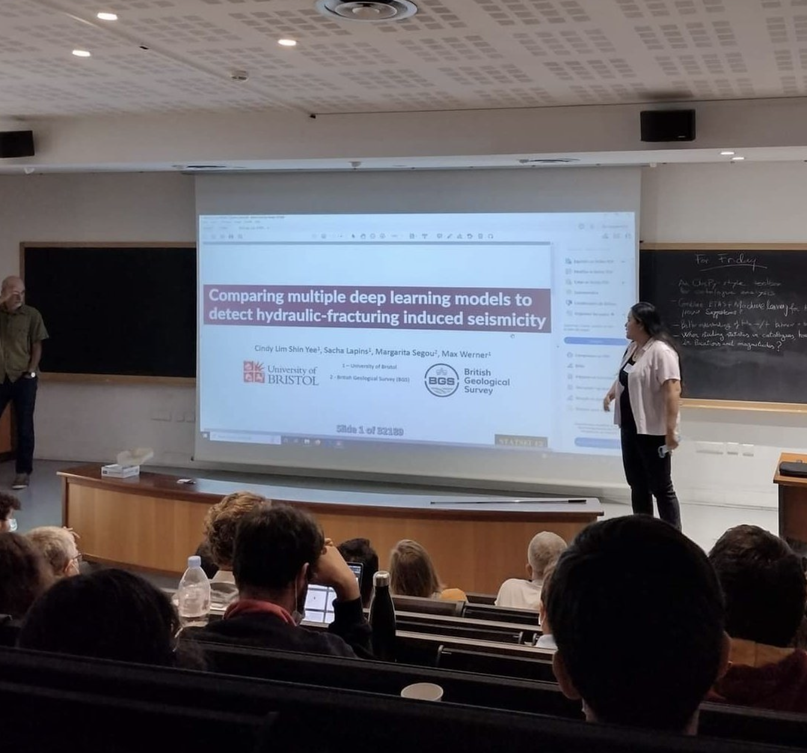
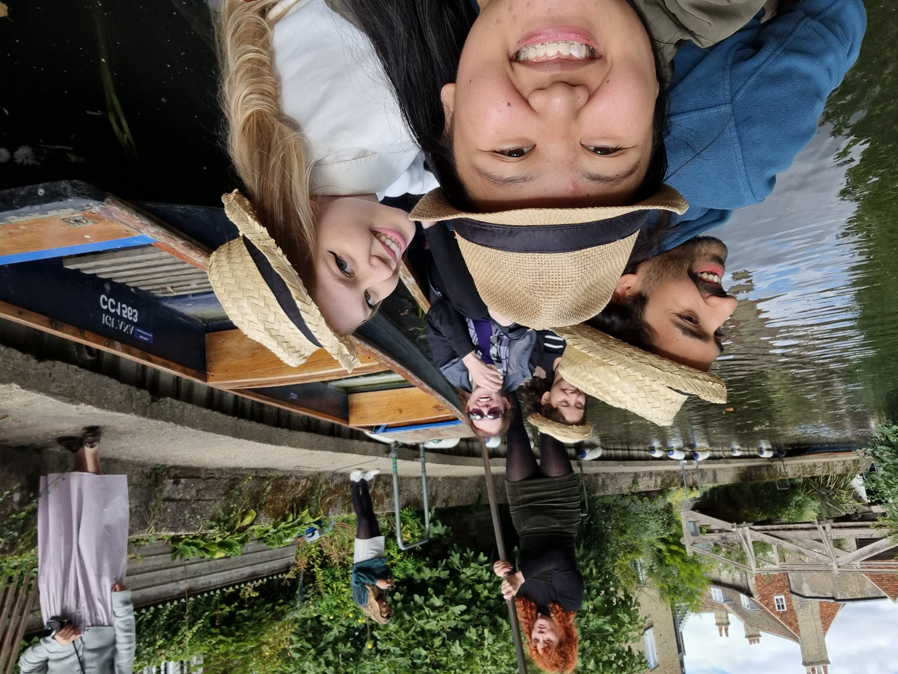
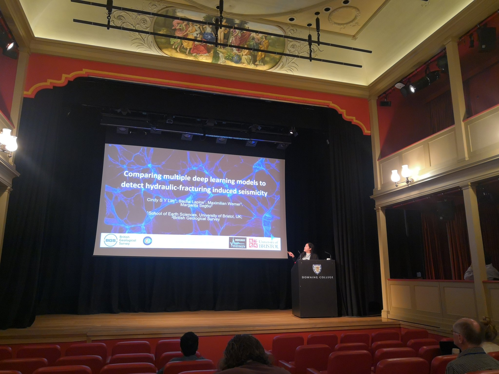
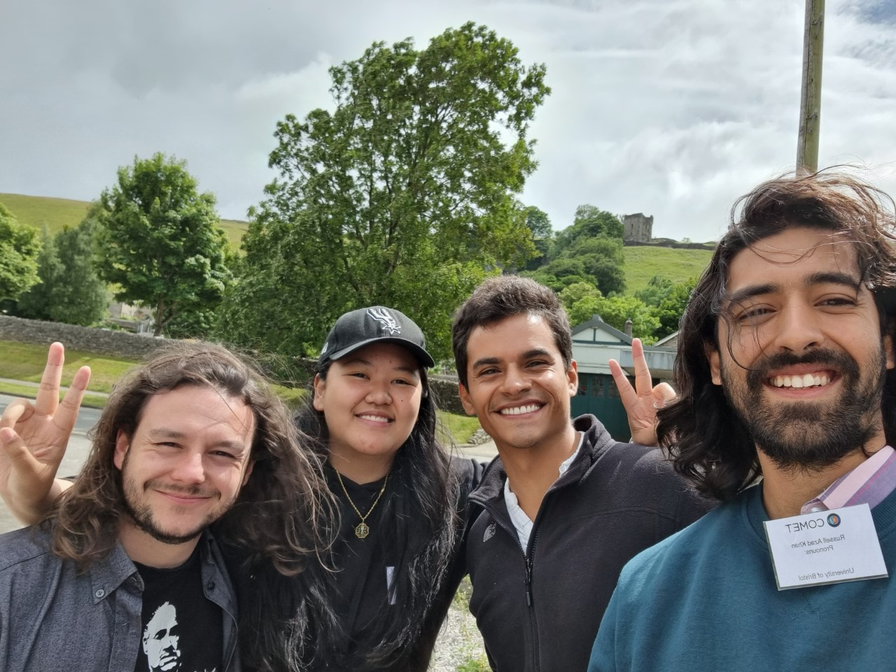

## Conferences I've been to:

<h3 style="margin-bottom:2px;">American Geophysical Union (AGU) Fall Meeting 2023</h3>

<b>San Francisco, California</b> 
11-15 Dec 2023

<ul style="margin-left: -1.4em;">
  <li>Poster: "Analyzing low-magnitude induced seismicity using deep learning phase picking: a case study from Preston New Road, UK"</li>
</ul>

<i>Looking excited to present my poster at AGU!</i>

<h3 style="margin-bottom:2px;">Seismological Society of America (SSA) Annual Meeting 2023</h3>

<b>San Juan, Puerto Rico</b> 
17-21 Apr 2023

<ul style="margin-left: -1.4em;">
  <li>Talk: "Deep learning phase pickers: How well can they detect induced seismicity?"</li>
</ul>

<i>Cute group pic with the research group!</i>

<i>Giving my talk at SSA!</i>

<h3 style="margin-bottom:2px;">STATSEI (Statistical Seismology International Conference) 12</h3>

<b>Cargese, France</b> 
17-21 Oct 2022

<ul style="margin-left: -1.4em;">
  <li>Poster: "Comparing multiple deep learning models to detect hydraulic-fracturing induced seismicity."</li>
</ul>

<i>Oh look it's me giving a talk!</i>

<h3 style="margin-bottom:2px;">BGA-PGRiP (British Geophysical Association Postgraduate Research in Progress) Meeting 2022</h3>

<b>Cambridge, UK</b> 
12-14 Sept 2022

<ul style="margin-left: -1.4em;">
  <li>Talk: "Comparing multiple deep learning models to detect hydraulic-fracturing induced seismicity."</li>
</ul>

<i>Oh look it's me on a punt!</i>

<h3 style="margin-bottom:2px;">British Seismological Meeting (BSM) 2022</h3>

<b>Cambridge, UK</b> 
14-16 Sept 2022

<ul style="margin-left: -1.4em;">
  <li>Talk: "Comparing multiple deep learning models to detect hydraulic-fracturing induced seismicity."</li>
</ul>

<i>Presenting my research on a very theatrical stage</i>

<h3 style="margin-bottom:2px;">COMET Annual Meeting 2022</h3>

<b>Castleton, Derbyshire, UK</b> 
4-5 July 2022

<ul style="margin-left: -1.4em;">
  <li>Poster: "Comparison of multiple deep learning models to detect induced seismicity."</li>
</ul>

<i>The Peak District was pretty nice.</i>

<h3 style="margin-bottom:2px;">SCEC (Southern California Earthquake Center) Annual Meeting 2021</h3>

<b>Online</b> 
12-17 Sept 2021

<ul style="margin-left: -1.4em;">
  <li>Poster: "Microseismic monitoring using deep learning."</li>
</ul>
